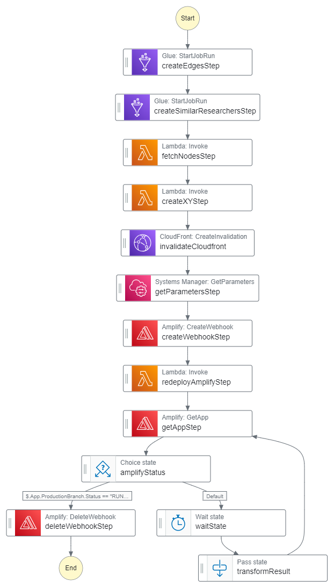

# Knowledge Graph Data Pipeline Deep Dive

The goal of the Knowledge Graph Pipeline is to populate the database with data that can be used to generate a graph of researchers' connections.

## 1. Data Transformation
The Knowledge Graph data pipeline consists of two glue jobs. 

The first glue job transforms existing researcher and publication data from the PostgreSQL database. It then uses the transformed data to populate the edges_full table in the database, which defines how researchers will be connected to eachother in the graph. 

The second glue job transforms existing researcher data from the PostgreSQL database. It then uses the transformed data to populate the potential_edges table in the database, which defines researchers who are similar to eachother based on shared keywords.

## 2. Knowledge Graph Tables Schema

### `edges_full` table

| Column Name | Description 
| ----------- | ----------- 
| source_id | The scopus id of the source researcher
| target_id | The scopus id of the target researcher
| publication_ids | The ids of the publications that the two researchers share
| num_publications | The number of publications that are shared between the two researchers
| last_updated | A unix timestamp for when the table was last updated

### `potential_edges` table

| Column Name | Description 
| ----------- | ----------- 
| source_id | The scopus id of the source researcher
| target_id | The scopus id of the target researcher
| shared_keywords | The keywords that the two researchers share
| last_updated | A unix timestamp for when the table was last updated

## 3. Using Cloudfront

Using GraphQL resolvers to fetch the list of nodes and edges when rendering the knowledge graph is slow. To speed this process up, the nodes and edges are also stored in an S3 bucket as files called *nodes.json* and *edges.json* respectively. This bucket acts as a source to a Cloudfront distribution which distributes copies of this data to edge locations worldwide, allowing faster access. To create these cache files in the S3 bucket, a Step Functions State Machine is used (described in the next section).

## 4. State Machine Workflow

Creating the cache files and making them accessible to the Amplify deployment is done automatically by the Step Functions State Machine shown below.

Running the state machine automatically runs the two glue jobs associated with creating the tables associated with the graph in the database. Then, depending on the structure of the graph, a display layout is determined. This is done by using the graphology-layout-forceatlas2 alogorithm which gives each node an x and a y coordinate postion. The node data (with the positions) and the edge data is then stored in the S3 bucket.

The state machine also needs to redeploy Amplify. The Amplify runtime needs the Cloudfront URL to send requests to. However, since the backend (and hence the cloudfront distribution) is deployed after the first Amplify deployment, this is not possible. Redeploying Amplify as part of this state machine ensures that Amplify gets access to the Cloudfront URL as an environment variable. Amplify Webhooks are used for this purpose.