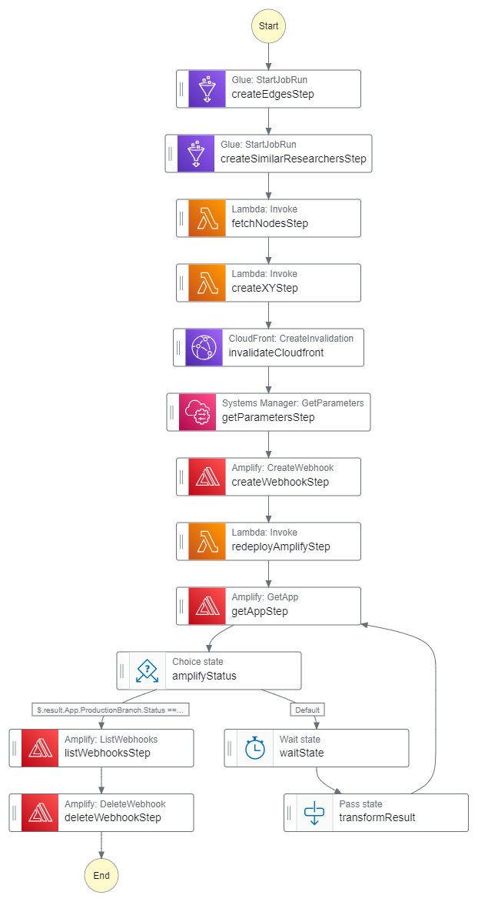

# Knowledge Graph Data Pipeline Deep Dive

The goal of the Knowledge Graph Pipeline is to populate the database with data that can be used to generate a graph of researchers' connections.

## 1. Data Transformation
The Knowledge Graph data pipeline consists of two glue jobs. 

The first glue job transforms existing researcher and publication data from the PostgreSQL database. It then uses the transformed data to populate the edges_full table in the database, which defines how researchers will be connected to eachother in the graph. 

The second glue job transforms existing researcher data from the PostgreSQL database. It then uses the transformed data to populate the potential_edges table in the database, which defines researchers who are similar to eachother based on shared keywords.

## 2. Knowledge Graph Tables Schema

### `edges_full` table

| Column Name | Description 
| ----------- | ----------- 
| source_id | The scopus id of the source researcher
| target_id | The scopus id of the target researcher
| publication_ids | The ids of the publications that the two researchers share
| num_publications | The number of publications that are shared between the two researchers
| last_updated | A unix timestamp for when the table was last updated

### `potential_edges` table

| Column Name | Description 
| ----------- | ----------- 
| source_id | The scopus id of the source researcher
| target_id | The scopus id of the target researcher
| shared_keywords | The keywords that the two researchers share
| last_updated | A unix timestamp for when the table was last updated

## 3. Using Cloudfront

Using GraphQL resolvers to fetch the list of nodes and edges when rendering the knowledge graph is slow. To speed this process up, the nodes and edges are also stored in an S3 bucket as files called *nodes.json* and *edges.json* respectively. This bucket acts as a source to a Cloudfront distribution which distributes copies of this data to edge locations worldwide, allowing faster access. To create these cache files in the S3 bucket, a Step Functions State Machine is used (described in the next section).

## 4. State Machine Workflow

Creating the cache files and making them accessible to the Amplify deployment is done automatically by the Step Functions State Machine shown below.

The following is a brief description of each step in the state machine:

1. **createEdgesStep**: This glue job transforms existing researcher and publication data from the PostgreSQL database. It then uses the transformed data to populate the edges_full table in the database, which defines how researchers will be connected to each other in the graph. It also stores the edges as a JSON file in an S3 bucket.

2. **createSimilarResearchersStep**: This glue job transforms existing researcher data from the PostgreSQL database. It then uses the transformed data to populate the potential_edges table in the database, which defines researchers who are similar to eachother based on shared keywords.

3. **fetchNodesStep**: A Lambda function to extract the node data for all nodes from the database and store it as a JSON file in an S3 bucket. 

4. **createXYstep**: A Lambda function to update all nodes in the S3 bucket JSON file with x and y coordinates that will determine the layout of the graph. This layout is calculated by using the [graphology-layout-forceatlas2](https://www.npmjs.com/package/graphology-layout-forceatlas2) algorithm in this function.

5. **invalidateCloudfront**: The Cloudfront distribution that serves the graph content acts like a cache. So, unless the cache is invalidated, it will continue to serve the same outdated content for a few hours. To prevent that, the state machine runs an invalidation on the Cloudfront distribution.

6. **getParametersStep**: Information about the Amplify app (app id and branch name) is stored as SSM parameters during the first Amplify build. These parameters are accessed during this step to feed to the next step.

7. **createWebhookStep**: An Amplify webhook is created.

8. **redeployAmplifyStep**: A Lambda function that sends a post request to the webhook created. This results in the Amplify app to redeploy.

9. **getAppStep**: This step checks the Amplify app to make sure it has been redeployed. Deleting the webhook before making sure of this sometimes causes the app tonot redeploy. 

10. **amplifyStatus**: This step checks if the app status from the previous state is set to "RUNNING" which means that it is redeploying. If it is, control is transfered to the deleteWebhookStep else to the waitState.

11. **waitState**: Wait for 3 seconds before checking the app status again.

12. **transformResult**: An intermediate state responsible for transforming the input data into the right format for processing by the getAppStep.

13. **deleteWebhookStep**: Delete the created webhook.

Running the state machine automatically runs the two glue jobs associated with creating the tables associated with the graph in the database. Then, depending on the structure of the graph, a display layout is determined. This is done by using the [graphology-layout-forceatlas2](https://www.npmjs.com/package/graphology-layout-forceatlas2) alogorithm which gives each node an x and a y coordinate postion. The node data (with the positions) and the edge data is then stored in the S3 bucket.

The state machine also needs to redeploy Amplify. The Amplify runtime needs the Cloudfront URL to send requests to. However, since the backend (and hence the cloudfront distribution) is deployed after the first Amplify deployment, this is not possible. Redeploying Amplify as part of this state machine ensures that Amplify gets access to the Cloudfront URL as an environment variable. Amplify Webhooks are used for this purpose.